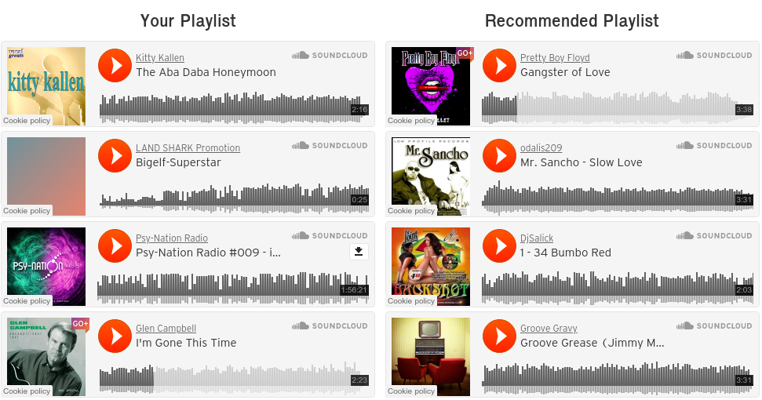

# Song Recommendations
Given a playlist curated from the [MillionSongDataset](http://millionsongdataset.com/), give song recommendations that are similar to the playlist.
A subset of 10,000 random songs were taken from the dataset to be used in our analysis.

    

## How to run it!

### Using Python Virtual Environments (Python 3.5+)

Create a virtual environment and cd in

>`python3 -m venv <name_of_venv>`
>`cd <name_of_venv>`

Activate the venv which changes your paths

>`source ./bin/activate`

Clone the repository and cd in

>`git clone git@csil-git1.cs.surrey.sfu.ca:bvtrinh/353-project.git`
>`cd 353-project`

Install requirements

>`pip3 install -r requirements.txt`

Afterwards run the Jupyter Notebook

>`jupyter-notebook`

Open the index.ipynb for song recommendations!

#### IF you want to try a different 10,000 songs 
Download the subset from the [MillionSongDataset](http://millionsongdataset.com/pages/getting-dataset/)

There will be two folders contained in the main folder:

`AdditionalFiles/` `data/`

Using the scripts in `parser/`, generate the data files for the system

Aggregate the h5 files to generate `from_h5.csv`:

>`python3 h5_to_csv.py data from_h5.csv`

Aggregate the db files contained in `AdditionalFiles/` to generate `from_sql.csv`:

>`python3 db_to_csv.py subset_artist_term.db subset_artist_similarity.db subset_track_metadata.db`

Combine the two output files to generate `songs.csv`:

>`python3 combine.py from_sql.csv from_h5.csv`

Create `artist.csv` with:

>`python3 artist_filter.py from_sql.csv`

Overwrite the files in `data/` with the newly created `artists.csv` and `songs.csv`